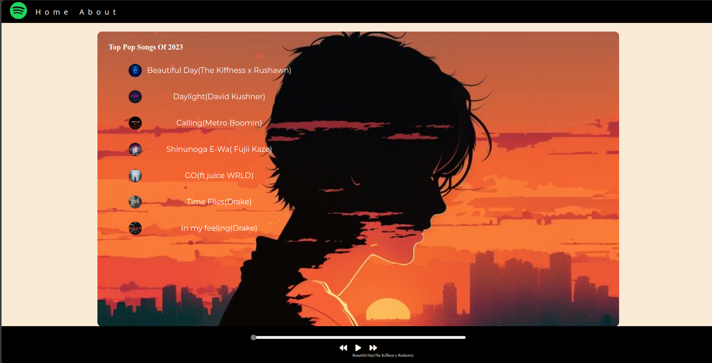

# Web-Based Music Player



## Overview

This project is a web-based music player designed to provide users with an enjoyable and seamless music experience. Featuring a sleek and modern interface, the music player allows users to explore and listen to popular tracks effortlessly.

## Key Features

- **Song Selection:** Browse through a curated list of top pop songs from 2023. Each song is displayed with an attractive cover image and its title.

- **Playback Controls:** Easily control your music with essential playback functions, including play, pause, forward, and backward buttons.

- **Progress Bar:** The intuitive progress bar shows the current playback position and allows users to seek through the song for precise navigation.

- **Song Information:** Stay informed with the currently playing song's title and an engaging animated GIF that enhances the listening experience.

- **Responsive Design:** The player is built to be responsive, ensuring it looks and functions beautifully on various screen sizes, from desktop monitors to mobile devices.

## Installation

1. Clone the repository:

    ```bash
    git clone https://github.com/ShubhamNegi4/Music-Player.git
    ```

2. Open the `index.html` file in your web browser to start using the music player.

## Usage

Simply open the `index.html` file in your web browser to start exploring and enjoying your favorite tracks. Use the playback controls to manage your listening experience and browse the list of songs to find your favorites.

